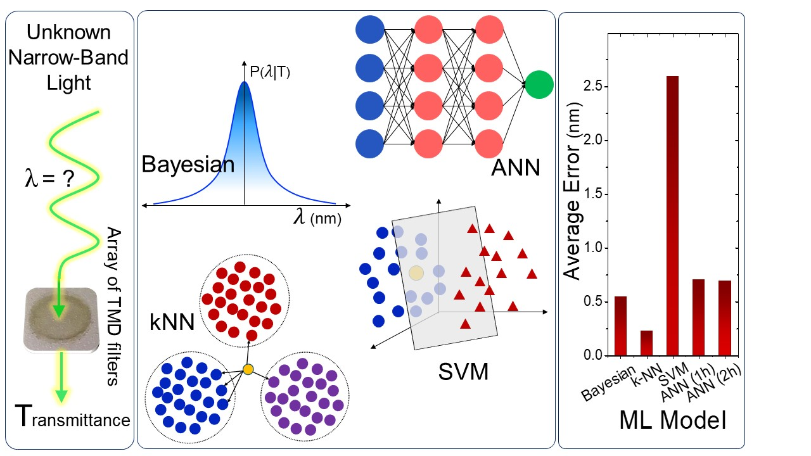
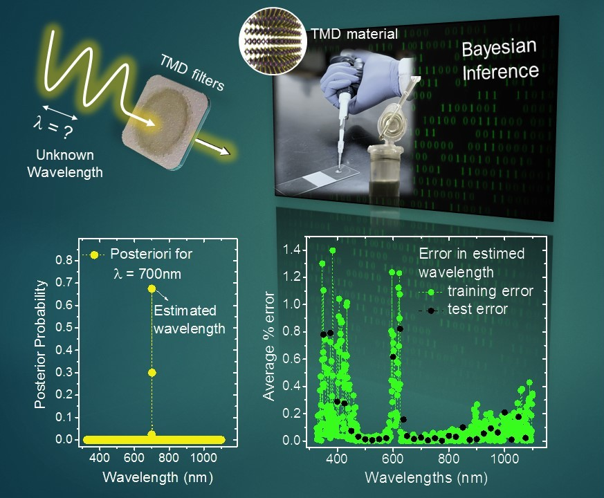

# Use-specific High Performance Cyber-Nanomaterial Optical Detectors



This is the training pipeline used for:

Davoud Hejazi, Shuangjun Liu, Amirreza Farnoosh, Sarah Ostadabbas, Swastik Kar, "Development of Use-specific High Performance Cyber-Nanomaterial Optical Detectors by Effective Choice of Machine Learning Algorithms," 2019. [arXiv.1907.02161](https://arxiv.org/abs/1912.11751)

Contact: 
[Davoud Hejazi](hejazi.d@northeastern.edu),

[Sarah Ostadabbas](ostadabbas@ece.neu.edu)

This project is collection of several codes, for the purpose of teting the efficacy of various machine learning algorithms in estimating optical wavelength using optical transmittance data of nanomaterials-based thin-film filters.


## Preparation 
To run these codes, make sure the following are installed:

- PyTorch
- Sklearn

Download the codes and the data from this repository. Each folder is dedicated for a specific machine learning algorithm: ANN, SVM, Bayesian, kNN.

## Data files
The data are collected using Perkin-Elmer UVvisNIR spectrometer on 11 nanomaterial filters. Each file is a ".mat" or matlab file readbale by the Python codes given in this project. The given codes read these files automatically. The "trainT.mat" file is a tall matrix (75000 by 11) where each row is one training sample: a vector of 11 tramsmittance values btw 0 and 1. The "trainT_lables.mat" is 75000 by 1 matrix, where the element in each rwo is the lable (wavelength) of corresponding row in "trainT.mat" file. 
It's the same for the "testT.mat" and "testT_labels.mat" files except they have 7500 rows only. These tow files are used only for testing purposes.


## Running the wavelength estimation codes
Each code is inside the corresponding folder. To run the ANN, SVM and kNN codes copy the data in Data folder to each of these folders. The required data for Bayesain code is already in that folder and the only difference is that the Bayrsian code data is in excel sheets, while the data for other codes are as matlab data files that these codes will read directly. Below is explanaiton of how to use each codes that are inside the folders ANN, Bayesian, SVM, and kNN.


## ANN: Artificial neural networks, using Torch
### NN_wave_class_MSELoss_T_1h.py: ###

This code which is inside ANN folder, creates a 3-layer fully connected neural network architecture, an input layer, a hidden layer and an output laye, to train the model, and finally outputs a file containing 
the estimated wavelengths as well as truth-value wavelengths of the test samples. 
The training data, test data and labels were initially extracted in MATLAB, so we kept them 
the way they were. Trainng set and test set are long matrices of 11 columns of transmittances 
values, one column per filter. The label files are single column vectors containing the labels 
corresponding to each row of the training/tests sets. The samples should be randomly shuffled 
before inputing to the code. The suffled data as ".mat" files are provided in the Data folder.

This code can either start training the model from scracth or use already trained model, 
depending on whether the "Restore" value is set to False or True (shown below). 
If Restore == True, the code will load from a saved model in './ckpt_nnT_1h_files', else, it 
will create the './ckpt_nnT_1h_files' to save the parameter files. The code also can run on 
GPU as well as CPU if GPU is available. While training, the code will output the training 
and testing accuracy. When the number of training loops shown by epoch_num is finished the code 
evaluates the estimated wavelengths of test samples and writes them in the file named
'Estimation_by_MSELoss_T_1h.xlsx'; it also outputs the elapsed time for testing the entire
test set.

### NN_wave_class_MSELoss_T_2h.py: ###
This code which is inside ANN folder, creates a 4-layer fully connected neural network architecture, an input layer, two hidden layers and an output laye, to train the model, and finally outputs a file
containing the estimated wavelengths as well as truth-value wavelengths of the 
test samples. The training data, test data and labels were initially extracted in MATLAB,
so we kept them the way they were. Trainng set and test set are long matrices of 11 
columns of transmittances values, one column per filter. The label files are single column
vectors containing the labels corresponding to each row of the training/tests sets.
The samples should be randomly shuffled before inputing to the code. The suffled data as ".mat"
files are provided in the Data folder.

This code can either start training the model from scracth or use already 
trained model, depending on whether the "Restore" value is set to False or True (shown below). 
If Restore == True, the code will load from a saved model in './ckpt_nnT_2h_files', else, it 
will create the './ckpt_nnT_2h_files' to save the parameter files. The code also can run on 
GPU as well as CPU if GPU is available. While training, the code will output the training 
and testing accuracy. When the number of training loops shown by epoch_num is finished the code 
evaluates the estimated wavelengths of test samples and writes them in the file named
'Estimation_by_MSELoss_T_2h.xlsx'; it also outputs the elapsed time for testing the entire
test set.


## Bayesian inference, part 1:
### gather_stats.py: ###

Gathering statistics from the xlsx files. This code, which is inside Bayesian folder, reads a "Transmittance.xlsx" 
that contains entire training set and outputs a "trans.json" file that contains 
the statistics of mean average transmittance for each filter at each wavelength. 
In our case it contains 11 sheets, one sheet per nanomaterial filter (F1, F2, ..., F11). 
Each sheet contains transimttance spectrum that filter. The first column is wavelength, and from second column to the end the transmittance values are given. 

Furthermore, this file can read a second file "TestT.xlsx" containg the test samples.
The format of this file is the same as the Transmittance.xlsx file. Upon executing 
this code will read the test samples and put all of them in a "testT.csv" file in a 
single sheet in a way that each row is a sample of T vector including 11 transmittance
values t1, t2, ..., t11, one per filter. The total number of rows is equal to the total number of samples. If the test sample file is alredy at hand in the mentioned way and this part of the code is not needed the user can comment out the last two lines of code.

### Bayesian: Bayesian inference, part 2: ###
## analysis.py:

This code, which is inside Bayesian folder, is the main code to perform the Bayesian inference. It reads the "trans.json" file as well as "testT.csv" file, and outputs the estimated wavelengths for 
real/synthesied test samples  using maximum a posteriori or MAP estimation. The estimated wavelengths for synthesized test samples can show how well the model is working on the training set itself. This way, user can calculate test error and training error. Each section of this code can accomplish a different task. First, the used needs to run the code, but it will not output any results. To obtain results the user needs to call specific funcitons defined in this code. The task of each function is explained right before fucntion's definition. First, run the code; then choose a function, and call it from console or comand line. The functions that output desired results are pointed out by "Call this function for:". 


### SVM: Support vector machines, using Sklearn ###
### svm_SVC.py ###
This code, which is inside SVM folder, trains a support vector machine model by desired parameters and kernel type, and finally outputs a file containing the estimated wavelengths as well as truth-value 
wavelengths of the test samples. The training data, test data and labels were initially 
extracted in MATLAB, so we kept them the way they were. Trainng set and test set are 
long matrices of 11 columns of transmittances values, one column per filter. The label 
files are single column vectors containing the labels corresponding to each row of the 
training/tests sets. The samples should be randomly shuffled before inputing to the code. 

This code can either start training the model from scracth or use already 
trained model, depending on whether the "Restore" value is set to False or True (shown below). 
If Restore == True, the code will load from a saved model in './ckpt_svmT_files', else, it will 
create the './ckpt_svmT_files' to save the parameter files. When the "fit" function has finished 
its job the "predict" function evaluates the estimated wavelengths of test samples and writes 
them in the file named 'Estimation_by_SVM_T_linear.xlsx'; it also outputs the elapsed time for 
testing the entire test set.
The user may change the file name ending: "_linear" if different kernel is employed.


## kNN: k-nearest neighbors
### knn.m ###
### Finding best k for by instance k-nn ###
This code, which is a matlab code inside kNN folder, has two parts. Part 1, calculates the mean accuracy in estimating wavelengths of test set using k in the range k=[0:20] in order to find 
the best k that yileds the highest accuracy. This part of the code outputs 
the excel file 'kMeans.xlsx'. The largest value in this file should belong 
to the optimal k. This part only needs to be execued onece to find optimal k. 
For our data it turns out to be k=7. 

The second part is the main part that for each set of training and test
set, estimates the wavelengths of test set and writes them  in the
'knn_byInstance_k7.xlsx' along with the truth-value wavelengths. Upon
finishing, it also outputs the elapsed time for testing the entire test
set.

Here is the details of the input data to this code. The training data, test
data and labels were initially extracted in MATLAB,so we kept them the way 
they were. Trainng set and test set are long matrices of 11 columns of 
transmittances values, one column per filter. The label files are single 
column vectors containing the labels corresponding to each row of the \
training/tests sets. The samples should be randomly shuffled before inputing 
to the code. The suffled data as .mat files are provided in the Data folder.


## Citation 
If you found our work useful in your research, please consider citing our paper:

```
@article{hejazi2019development,
  title={Development of Use-specific High Performance Cyber-Nanomaterial Optical Detectors by Effective Choice of Machine Learning Algorithms},
  author={Hejazi, Davoud and Liu, Shuangjun and Farnoosh, Amirreza and Ostadabbas, Sarah and Kar, Swastik},
  journal={arXiv preprint arXiv:1912.11751},
  year={2019}
}
```
The current research was started in our previous research where we had introduced the idea of combing nanomaterials and data analytics for optical wavelength estimation for the first time. If you found our work useful in your research, please consider citing our paper:
```
@article{hejazi2019transition,
  title={Transition Metal Dichalcogenide Thin Films for Precise Optical Wavelength Estimation using Bayesian Inference},
  author={Hejazi, Davoud and Liu, Shuangjun and Ostadabbas, Sarah and Kar, Swastik},
  journal={ACS Applied Nano Materials},
  year={2019},
  publisher={ACS Publications}
}
```


## License 
* This code is for non-commertial purpose only. For other uses please contact ACLab of NEU. 
* No maintainence survice 


